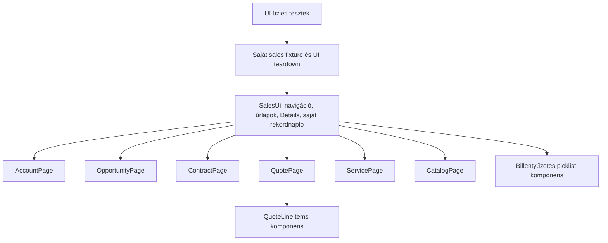

# Page Object Model ellenőrzés

Az üzleti tesztek a page objectok publikus UI-műveleteit és visszaolvasott mezőit használják. A szelektorok, dialogkezelés, navigáció és az aszinkron felületi várakozás a POM-ban vagy annak közös komponenseiben található. A business assertionök a tesztesetekben maradnak, a közös rekord-invariánsokat a page objectok ellenőrzik.

| Vizsgált terület | Eredmény / változtatás |
| --- | --- |
| Objektumhatárok | Account, Opportunity, Contract, Quote, Service és Catalog külön page object; a közös `SalesUi` kompozícióval szolgálja ki őket. |
| Ismétlődő UI-műveletek | Save/Cancel, Edit/New űrlap, pontos mezőkeresés, natív navigáció, Details-olvasás és törlés közös. Az azonos Quote terméktétel-wizard külön komponens. |
| Tesztekben szétszórt szelektorok | A Quote hiba-dialog, Quotes lista, Start/Stop Sync, kapcsolati link, Service jogosultsági oldal és readonly Contract vezérlői a megfelelő POM-ba kerültek. |
| Scope / strictness | A szerkesztő dialogot a látható Save gomb azonosítja; a törlési/aktiválási megerősítést a konkrét akció. Pontos hozzáférhető nevek és saját rekord-ID-k szolgálnak célpontként. |
| Dinamikus Salesforce UI | A picklist a konkrét vezérlőre célzott natív ArrowDown/Enter műveletekkel dolgozik. Minden lépésnél újraolvassa a nyitott listát és a tényleges aktív opciót; Enter csak a pontos cél ID-jánál történhet. A form validációja által bezárt listát újranyitja; nem feltételezi a következő indexet. Csak a még nem mentett mezőválasztás ismétlődhet, Save vagy teljes teszt nem. Nincs koordinátás kényszerkattintás. |
| Várakozások | Láthatóság, engedélyezettség, URL, kiválasztott tab, mezőérték, megjelenő listanézet és UI-readback vezérelt; nincs fix `sleep`. |
| Persistencia | Mentés után friss rekordnavigáció és Details-kiolvasás. Az Account/Opportunity kapcsolatot a pontos rekordlink is bizonyítja. A DOM evaluation kizárólag látható mezőket olvas. |
| Tesztadat-tulajdon | A Save előtti saját napló, azonosító és név köti az adatot a teszthez. A POM idegen vagy már törölt rekord megnyitását visszautasítja. |
| Szerepkör | Opportunity New adminisztrátorral tiltott. UI Owner/Created By ellenőrzött. Az integráció külön Service-belépéssel és profilbizonyítékkal vizsgálja a readonly átadást. |
| Cleanup | A fixture `finally` ágában UI-törlés; félkész űrlapok elvetése. A closing dialog eltűnésére vár, mielőtt a következő műveletet kezdené. |
| POM és hitelesítés | A JWT adapter infrastruktúra, a setup UI-n ellenőrzi a belépést/profilt. Az üzleti page object nem olvas hitelesítési titkot. |
| AI útvonal | A három opcionális AI UI-eset ugyanazt a POM-előkészítést és determinisztikus friss UI-orákulumot használja. |

`npm run pom:check` statikusan ellenőrzi mind a hét üzleti tesztforrásfájlt: nincs bennük közvetlen `getBy*`, `browser.evaluate`, nyers DOM-szelektor, `fetch` vagy fix várakozás. Ez réteghatár-ellenőrzés; a tényleges UI-működést az élő regresszió bizonyítja. Az auth setup és a szintetikus infrastructure harness céljukból következően saját UI-locátorokat is használhatnak.

Új teszt esetén a folyamat elvárt viselkedése a tesztbe, a szelektor és a UI-művelet a megfelelő page objectba, az ismétlődő UI-rész a komponensbe kerüljön. A változáshoz a [test design](TEST_DESIGN.md) forrását is frissíteni kell. Az aktuális futási bizonyíték: [VERIFICATION.md](VERIFICATION.md).

Forrás: [Playwright Page Object Models](https://playwright.dev/docs/pom), [Salesforce Combobox](https://developer.salesforce.com/docs/platform/lightning-component-reference/guide/lightning-combobox.html).
