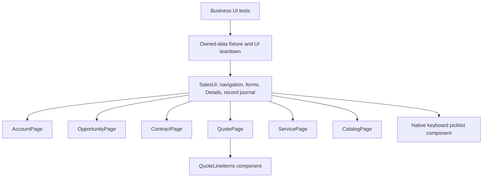

# Page Object Model review

Business tests use public page-object actions and UI readbacks. Selectors, dialogs, navigation and asynchronous UI waiting belong to page objects/shared components. Scenario assertions remain in tests; reusable record invariants are checked by page objects.

| Reviewed area | Finding / change |
| --- | --- |
| Object boundaries | Separate Account, Opportunity, Contract, Quote, Service and Catalog page objects composed by SalesUi. |
| Shared actions | Save/Cancel, Edit/New forms, exact field lookup, navigation, Details reads and deletion are centralized; Quote line wizard is a separate component. |
| Selector ownership | Quote validation dialog, related Quotes, sync actions, relationship links, Service denial and read-only Contract controls are encapsulated in their page objects. |
| Scope and strictness | Visible Save identifies editing dialogs; confirmation dialogs use the specific action. Exact accessible names and owned record IDs identify targets. |
| Dynamic picklists | Native ArrowDown/Enter targets the exact combobox. Each iteration reads the actual open list and active option ID; Enter is used only for the target. A list closed by form validation is reopened. Only an unsaved selection is repeated; Save and entire cases are never automatically retried. |
| Formatted numbers | Numeric inputs are strictly parsed from visible values, accepting USD formatting and grouping: 1 equals $1.00. Empty/invalid text does not become zero. String inputs use exact string equality. A synthetic UI case covers immediate formatting, 0, 0.01, grouping and clearing. |
| Waiting | Visibility, enablement, URL, tab state, field values, list readiness and UI readbacks drive waits; no fixed sleeps. |
| Persistence | Save is followed by fresh record navigation and Details reads. Exact Account/Opportunity link IDs verify relationships. DOM evaluation reads only visible fields. |
| Owned data | A pre-Save journal, exact ID/name and Description marker bind fixtures to the case. Opening foreign or already-deleted records is rejected. |
| Role correctness | Opportunity creation rejects administrators; UI Owner/Created By is verified. Integration opens separate JWT sessions and verifies visible profile identity. |
| Cleanup | UI deletion in fixture finally; unfinished forms discarded. Closing dialogs must disappear before the next action. |
| Authentication boundary | JWT adapter is infrastructure; setup verifies actual UI access/profile. Business page objects do not read authentication secrets. |
| Optional AI path | Same POM preparation, deterministic persisted UI assertions and cleanup for all three AI UI cases. |

`npm run pom:check` verifies all seven business test source files: no direct getBy locators, browser.evaluate, raw DOM selectors, fetch or fixed waits. This enforces the layer boundary; actual behavior is proven by live regression. Authentication setup and isolated infrastructure checks may use their own UI locators because of their purpose.

For new cases, add expected workflow behavior to the test, UI operations/selectors to the relevant page object and repeated UI sections to components. Update [test designs](TEST_DESIGN.md) and regenerate wiki pages. Actual execution evidence: [VERIFICATION.md](VERIFICATION.md).

Sources: [Playwright Page Object Models](https://playwright.dev/docs/pom), [Salesforce Combobox](https://developer.salesforce.com/docs/platform/lightning-component-reference/guide/lightning-combobox.html).
